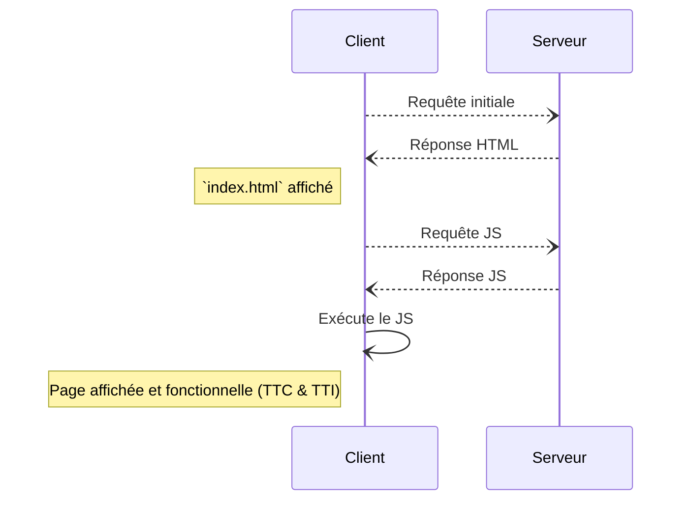
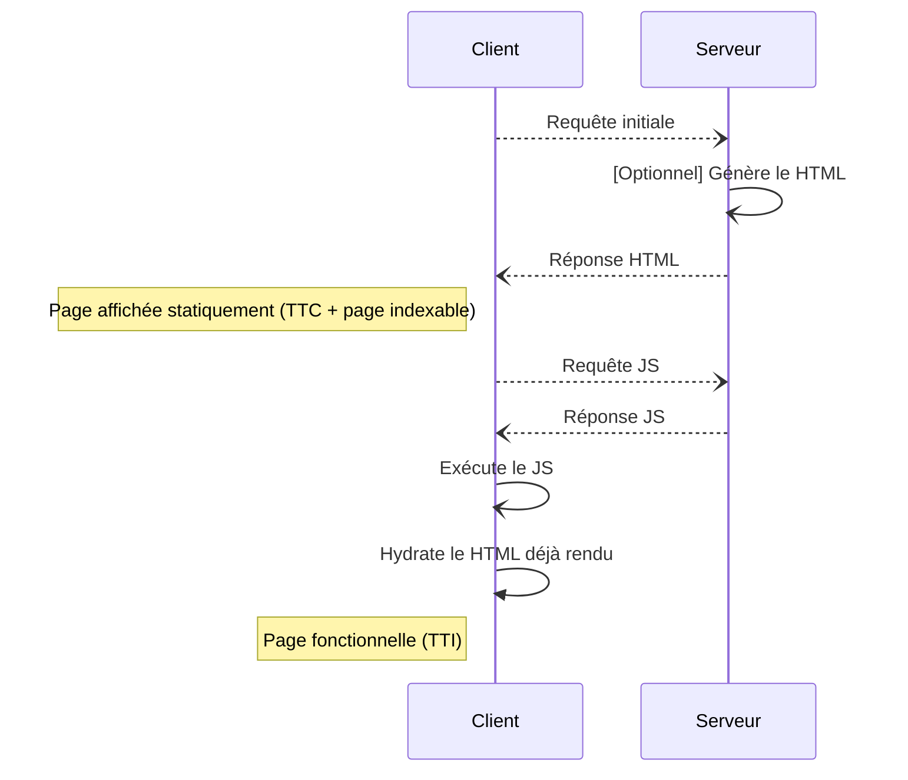

# Comparaison SPA et SSR

## SPA

```mermaid {scale: 0.5}
sequenceDiagram
    Client--)Serveur: Requête initiale
    Serveur--)Client: Réponse HTML
    Note left of Client: `index.html` affiché
    Client--)Serveur: Requête JS
    Serveur--)Client: Réponse JS
    Client-)Client: Exécute le JS
    Note left of Client: Page affichée et fonctionnelle (TTC & TTI)
```

## SSR

```mermaid {scale: 0.5}
sequenceDiagram
    Client--)Serveur: Requête initiale
    Serveur-)Serveur: [Optionnel] Génère le HTML
    Serveur--)Client: Réponse HTML
    Note left of Client: Page affichée statiquement (TTC + page indexable)
    Client--)Serveur: Requête JS
    Serveur--)Client: Réponse JS
    Client-)Client: Exécute le JS
    Client->>Client: Hydrate le HTML déjà rendu
    Note left of Client: Page fonctionnelle (TTI)
```

